# Hi there 👋

 

<h2>DevSecOps Internal Developer Platforms</h2>

<h2>Stats & Metrics</h2>

<h2>AI & Bots</h2>

<h2>Cybersecurity</h2>

<h2>Game Streaming</h2>

<h2>Containers</h2>

<!-- markdownlint-configure-file {
  "MD033": {
    "allowed_elements": [
      "h1",
      "h2",
      "h3",
      "a",
      "br",
      "img",
      "span"
    ]
  }
} -->
